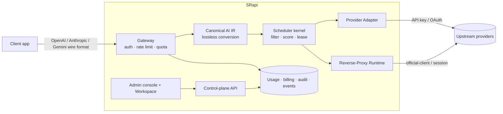

# SRapi

**A self-hosted AI gateway. One endpoint, every provider, your accounts, your control.**

Route OpenAI, Anthropic, Gemini, and CLI / web-session accounts through one OpenAI-compatible
endpoint — with built-in scheduling, quotas, billing, and audit logs.

[](LICENSE)
[](apps/api/go.mod)
[](apps/web/package.json)
[](packages/openapi/openapi.yaml)
[](specs/STATUS.md)

English · [简体中文](README.zh-CN.md)

---

## What is SRapi

SRapi is a single AI gateway you run yourself. Your applications call **one OpenAI-compatible
endpoint**; SRapi authenticates the request, applies rate limits and quotas, normalizes it to a
canonical representation, picks the best upstream **provider account** with an adaptive scheduler,
dispatches it through a **provider adapter** or a **reverse-proxy runtime**, and records usage,
cost, and audit evidence.

It is built for engineers and platform teams who want to consolidate many AI providers and accounts
behind one stable interface — and to resell or meter that access — without surrendering control of
their keys, routing, or data.

- **Many providers, one API.** OpenAI, Anthropic, and Gemini wire formats in, OpenAI / Anthropic /
  Gemini routes out — converted losslessly through a shared canonical AI representation.
- **Real accounts, not just API keys.** Schedule plain API-key accounts *and* CLI / desktop /
  web-session accounts (Codex CLI, Claude Code CLI, ChatGPT Web, Antigravity, Gemini CLI) through
  the reverse-proxy runtime, with per-account TLS / HTTP fingerprinting and isolated cookie jars.
- **Adaptive scheduling.** A pluggable scheduler kernel scores candidates on health, quota, latency,
  cache affinity, session stickiness, priority tier, live concurrency, and cost.
- **A full control plane.** A Next.js admin console and a self-service workspace cover accounts,
  models, keys, plans, pricing, payments, affiliate rebates, observability, and more.
- **OpenAPI-first.** A single contract (`packages/openapi/openapi.yaml`, 332 operations) generates
  the Go server types and the TypeScript SDK; drift is gated in CI.

> SRapi is a self-hosted runtime. It provides isolation and routing primitives only. It does **not**
> include any upstream Terms-of-Service bypass, CAPTCHA solving, credential scraping, or token
> harvesting. See [Security & compliance boundary](#security--compliance-boundary).

## Features

**Gateway**
- OpenAI-compatible, Anthropic Messages, and native Gemini endpoints with lossless protocol conversion
- Streaming (SSE) and WebSocket relay, including Realtime
- Per-key / per-user / per-account / per-model / per-group rate limits (RPM, TPM, concurrency)
- Cross-provider failover, session stickiness, idempotency keys, request timeouts
- Outbound SSRF egress guard and strict header hygiene

**Upstream accounts**
- API-key, OAuth-refresh, and reverse-proxy (CLI / desktop / web session) runtime classes
- Account groups, priority tiers, proxy binding, per-account model mapping
- Background health probes, availability rollups, scheduled connectivity tests, quota refresh
- OAuth re-auth parking, credential re-encryption, write-only credential storage

**Scheduling**
- Pluggable scheduler kernel with versioned strategies, dry-run, and shadow decisions
- Capability taxonomy (request / model / provider / endpoint) drives hard filters
- Recorded decision and feedback evidence for every request

**Control plane & commerce**
- Admin console + self-service workspace (Next.js, App Router)
- Subscription plans, decimal-safe pricing, balance billing with pay-as-you-go overage
- Payments: Stripe, Alipay, WeChat Pay (signed, idempotent webhooks)
- Affiliate / invite rebates, redeem codes, promo codes, announcements
- Admin AI Copilot and a gateway-billed Playground

**Accounts & auth**
- Console sessions (cookie + CSRF), TOTP 2FA, password reset, email verification
- Public registration with policy gates, OAuth / OIDC sign-in, CAPTCHA support
- Roles & permissions (RBAC), workspaces, per-user custom attributes

**Operations & observability**
- Prometheus `/metrics`, OpenTelemetry traces, SLO definitions, burn-rate alerts
- Durable system logs, audit logs, channel/account health monitoring
- Data-retention workers, PostgreSQL backup/restore, release smoke tests
- Transactional email (SMTP), notification preferences, one-click unsubscribe

## Supported endpoints

The gateway accepts the wire formats below. Most OpenAI-compatible routes also have provider-alias
variants (e.g. `/api/provider/{provider}/v1/...`) that pin a specific provider.

| Family | Routes |
| --- | --- |
| **OpenAI Chat / Responses** | `POST /v1/chat/completions`, `POST /v1/responses`, `POST /v1/responses/compact`, `GET /v1/responses/ws`, `GET /v1/responses/{id}/input_items` |
| **OpenAI auxiliary** | `POST /v1/embeddings`, `POST /v1/moderations`, `POST /v1/rerank`, `POST /v1/images/{generations,edits,variations}`, `POST /v1/audio/{speech,transcriptions}` |
| **OpenAI Realtime** | `GET /v1/realtime` (WebSocket relay) |
| **Anthropic Messages** | `POST /v1/messages`, `POST /v1/messages/count_tokens` |
| **Gemini (native)** | `GET /v1beta/models`, `POST /v1beta/models/{model}:generateContent`, `:streamGenerateContent`, `:countTokens` |
| **Discovery / usage** | `GET /v1/models`, `GET /v1/usage` |

The full machine-readable contract is [`packages/openapi/openapi.yaml`](packages/openapi/openapi.yaml).

## Upstream account types

SRapi can put traffic on an upstream through three runtime classes:

| Runtime class | What it is | Credentials |
| --- | --- | --- |
| `api_key` | Standard provider API access | Provider API key (optionally via a configured proxy + TLS profile) |
| OAuth-refresh | Provider accounts that mint short-lived tokens | OAuth `refresh_token`, exchanged and re-encrypted by SRapi |
| Reverse-proxy ("2api") | Official client / web-session identities | OAuth / session / desktop / CLI tokens, dispatched as the official client |

Reverse-proxy runtime identities implemented today:

`reverse-proxy-openai-compatible` ·
`reverse-proxy-codex-cli` ·
`reverse-proxy-claude-code-cli` ·
`reverse-proxy-claude-web` ·
`reverse-proxy-chatgpt-web` ·
`reverse-proxy-antigravity` ·
`reverse-proxy-gemini-cli`

Built-in provider presets (base URL, auth mode, default model catalog, route aliases) include
**OpenAI**, **Anthropic**, **Gemini**, **Antigravity**, plus OpenAI- / Anthropic-compatible presets
for **DeepSeek, Moonshot/Kimi, Qwen, Zhipu/GLM, Grok, Groq, Mistral, Together, OpenRouter**, and any
custom OpenAI-compatible or Anthropic-compatible upstream.

## Architecture



The backend is a modular Go monolith — ~40 domain modules behind explicit contracts, talking to
PostgreSQL and Redis. The frontend is a Next.js console. Both are generated against one OpenAPI
contract.

```text
SRapi/
├── apps/
│   ├── api/                 # Go backend (gateway, scheduler, modules, workers)
│   │   ├── internal/modules # ~40 domain modules behind contracts
│   │   ├── ent/schema       # Ent schemas (data model)
│   │   └── migrations       # Atlas-versioned PostgreSQL migrations
│   └── web/                 # Next.js console (admin + self-service workspace)
├── packages/
│   ├── openapi/             # OpenAPI contract (source of truth)
│   └── sdk/typescript/      # Generated TypeScript SDK
├── deploy/                  # Docker Compose, Prometheus, Alertmanager, Tempo
├── docs/                    # Architecture, specs, and operations docs
├── specs/                   # Long-running development execution specs
├── examples/                # curl / TypeScript / Python gateway examples
└── tools/                   # Codegen, checks, dev scripts
```

**Stack** — Go 1.26 · `net/http` (standard-library router) · Ent + Atlas · PostgreSQL 16 · Redis 7 ·
Prometheus · OpenTelemetry · `go-oidc`. Frontend: Next.js 16 (App Router) · React 19 · TypeScript ·
Tailwind CSS 4 · TanStack Query · the generated OpenAPI client.

See [`docs/ARCHITECTURE.md`](docs/ARCHITECTURE.md) for module boundaries and dependency direction.

## Quick start

Requirements: Docker + Docker Compose. (For local development without containers: Go 1.26, Node 22,
PostgreSQL 16, Redis 7.)

### Option A — Docker Compose (full stack)

```bash
git clone <your-fork-url> SRapi && cd SRapi

# Generate a local .env with strong random secrets (does not overwrite an existing .env).
make bootstrap-env

# Build and start PostgreSQL, Redis, the API, and the console.
docker compose -f deploy/docker-compose.yml up --build
```

- API: <http://127.0.0.1:8080>  ·  Console: <http://127.0.0.1:3000>
- Health: `GET /livez`, `GET /readyz`, `GET /api/v1/health`; metrics: `GET /metrics`
- Optional monitoring stack: append `--profile observability` (Prometheus :9090, Alertmanager :9093)

> **Behind a reverse proxy:** point the public front door at the **console on :3000**
> (which forwards `/api` and `/v1` to the API), not at the API on :8080 — otherwise no
> UI is served. See [`deploy/nginx.example.conf`](deploy/nginx.example.conf). To publish on a
> custom origin, set `SRAPI_API_PROXY_TARGET` (it is baked into the web image at build time,
> so rebuild the `web` image after changing it).

### Option B — Local development

```bash
make bootstrap-env       # create .env with generated secrets
make dev-up              # start PostgreSQL, Redis, and the API
make web-install         # install console dependencies
make web-dev             # start the console (Next.js dev server)
```

Sign in to the console with `BOOTSTRAP_ADMIN_EMAIL` from your `.env`. `make bootstrap-env` generates
a strong admin password and does not print it; if you instead use the raw `.env.example` placeholder,
the credentials are the documented local defaults. Change them before exposing the service.

> The bootstrap admin is seeded **only on first start** (when that email does not yet exist).
> Changing `BOOTSTRAP_ADMIN_PASSWORD` in `.env` and restarting does **not** re-hash an existing
> admin — login will keep failing with the old password. To reset, either change
> `BOOTSTRAP_ADMIN_EMAIL` to a fresh address (a new admin is seeded with the current password),
> or delete the row and let bootstrap recreate it on the next restart:
>
> ```bash
> docker compose -f deploy/docker-compose.yml exec postgres \
>   psql -U srapi -d srapi -c "DELETE FROM users WHERE email='admin@srapi.local';"
> docker compose -f deploy/docker-compose.yml restart api
> ```

### First request

```bash
# Create a gateway API key in the console (API keys → Create), then:
curl http://127.0.0.1:8080/v1/chat/completions \
  -H "Authorization: Bearer $SRAPI_API_KEY" \
  -H "Content-Type: application/json" \
  -d '{"model":"gpt-4o-mini","messages":[{"role":"user","content":"Hello"}]}'
```

Runnable curl / TypeScript / Python examples live in [`examples/`](examples/README.md).

## Configuration

SRapi is configured entirely through environment variables. [`.env.example`](.env.example) documents
every key with safe local defaults; [`docs/CONFIGURATION_SPEC.md`](docs/CONFIGURATION_SPEC.md)
defines precedence and production constraints. Highlights:

| Area | Keys (selected) |
| --- | --- |
| Server | `SERVER_HOST`, `SERVER_PORT`, `SERVER_MODE` (`local` relaxes security defaults; production rejects weak secrets) |
| Storage | `STORAGE_BACKEND`, `DATABASE_*`, `REDIS_*` |
| Secrets | `JWT_SECRET`, `SRAPI_MASTER_KEY`, `API_KEY_PEPPER`, `TOTP_ENCRYPTION_KEY` (32-byte minimum) |
| Gateway | `GATEWAY_REQUEST_TIMEOUT_SECONDS`, `GATEWAY_REQUIRE_POSITIVE_BALANCE`, realtime slot limits |
| Auth | `BOOTSTRAP_ADMIN_*`, `OAUTH_CLIENT_SECRETS_JSON`, `OAUTH_ISSUERS_JSON`, `CAPTCHA_*` |
| Workers | health probe, quota refresh, connectivity test, balance charger, data retention, quality eval |
| Email | `EMAIL_SMTP_*`, `EMAIL_PUBLIC_BASE_URL` (deployment-env only; never stored in settings) |
| Payments | Stripe / Alipay / WeChat smoke-test inputs (live providers are configured in the console) |

> In `SERVER_MODE=local` SRapi accepts the placeholder secrets so you can start immediately. In any
> other mode it refuses to boot with weak or default secrets or a default admin password.

## Documentation

The full index is [`docs/README.md`](docs/README.md). Start here:

| If you want to… | Read |
| --- | --- |
| Understand the platform & roadmap | [`docs/PROJECT_DEVELOPMENT_PLAN.md`](docs/PROJECT_DEVELOPMENT_PLAN.md) |
| Understand the backend architecture | [`docs/ARCHITECTURE.md`](docs/ARCHITECTURE.md), [`docs/MODULE_INTERFACE_CONTRACTS.md`](docs/MODULE_INTERFACE_CONTRACTS.md) |
| Understand endpoint conversion | [`docs/AI_ENDPOINT_COMPATIBILITY.md`](docs/AI_ENDPOINT_COMPATIBILITY.md), [`docs/GATEWAY_ROUTE_MATRIX.md`](docs/GATEWAY_ROUTE_MATRIX.md) |
| Understand the scheduler | [`docs/SCHEDULING_KERNEL_DESIGN.md`](docs/SCHEDULING_KERNEL_DESIGN.md), [`docs/SCHEDULER_V1_SPEC.md`](docs/SCHEDULER_V1_SPEC.md) |
| Add or migrate upstream accounts | [`docs/REVERSE_PROXY_SPEC.md`](docs/REVERSE_PROXY_SPEC.md), [`docs/MIGRATION_GUIDE_2API.md`](docs/MIGRATION_GUIDE_2API.md) |
| Deploy & operate | [`docs/OPERATIONS.md`](docs/OPERATIONS.md), [`docs/CONFIGURATION_SPEC.md`](docs/CONFIGURATION_SPEC.md), [`docs/OBSERVABILITY_SPEC.md`](docs/OBSERVABILITY_SPEC.md) |
| Review the security model | [`docs/SECURITY_MODEL.md`](docs/SECURITY_MODEL.md), [`SECURITY.md`](SECURITY.md) |
| Integrate as a client | [`examples/README.md`](examples/README.md), [`docs/OPENAPI_CONTRACT.md`](docs/OPENAPI_CONTRACT.md) |

## Development

```bash
make help        # list every target
make check       # the full quality gate (run before pushing)
```

`make check` runs OpenAPI lint + bundle, Go and TypeScript SDK codegen drift checks, TypeScript
typecheck, Ent generate check, migration check, Go architecture + code-quality + tests, the examples
check, the web lint/typecheck/build/test, and a secret scan. CI runs the same gate
([`.github/workflows/ci.yml`](.github/workflows/ci.yml)).

Common focused targets:

```bash
make openapi-codegen     # regenerate Go types + server interface from the contract
make openapi-ts-codegen  # regenerate the TypeScript SDK
make ent-generate        # regenerate the Ent client
make migration-diff      # generate the next versioned migration
make api-run             # run the API alone
make smoke-release       # pre-release smoke test (livez/readyz/metrics + gateway)
```

Windows PowerShell entry points are in `tools/dev.ps1` (`check`, `openapi`, `api`, `up`,
`smoke-gateway`). Contribution conventions are in [`CONTRIBUTING.md`](CONTRIBUTING.md), and the
engineering rules every change follows are in [`AGENTS.md`](AGENTS.md).

## Project status

SRapi is at **0.1.0 release-candidate** maturity. The gateway, scheduler, control plane, and
commerce surfaces are implemented and covered by tests and quality gates. Some integrations are
opt-in and verified through credential-gated smoke tests (live payment providers, certain
reverse-proxy upstreams) rather than continuous CI. The long-running development ledger and roadmap
live in [`specs/`](specs/README.md) ([`STATUS.md`](specs/STATUS.md), [`ROADMAP.md`](specs/ROADMAP.md)).

## Security & compliance boundary

SRapi's reverse-proxy runtime provides only self-hosted runtime capabilities and isolation
mechanisms. It does **not** include, and will not include, any upstream Terms-of-Service bypass,
CAPTCHA solving, cookie scraping, or token-harvesting logic. Operators are solely responsible for
ensuring that the accounts, regions, network egress, and automation they configure comply with each
upstream provider's terms — and they bear the associated compliance and account-ban risk.

Credentials are encrypted at rest and stored write-only (they are never returned by the API).
Report vulnerabilities privately per [`SECURITY.md`](SECURITY.md); the threat model is in
[`docs/SECURITY_MODEL.md`](docs/SECURITY_MODEL.md).

## Contributing

Contributions are welcome. Please read [`CONTRIBUTING.md`](CONTRIBUTING.md) and [`AGENTS.md`](AGENTS.md)
first, keep changes focused, update the OpenAPI contract and docs alongside code, and make sure
`make check` passes.

## License

SRapi is licensed under the **GNU Affero General Public License v3.0**. See [`LICENSE`](LICENSE).

AGPL-3.0 means that if you run a modified version of SRapi as a network service, you must make the
corresponding source available to its users.
