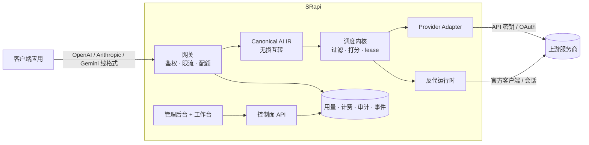

# SRapi

**一个自托管 AI 网关。一个入口，接入所有服务商，账号自管，调度可控。**

通过一个 OpenAI 兼容的接口，接入 OpenAI、Anthropic、Gemini 以及 CLI / 反代账号，
自带调度、配额、计费与用量审计。

[](LICENSE)
[](apps/api/go.mod)
[](apps/web/package.json)
[](packages/openapi/openapi.yaml)
[](specs/plans/STATUS.md)

[English](README.md) · 简体中文

---

## SRapi 是什么

SRapi 是一个你自己部署的 AI 网关。你的应用只调用**一个 OpenAI 兼容的接口**；SRapi 负责鉴权、
施加限流与配额、把请求归一化为统一的内部表示、用自适应调度器选出最合适的**上游账号**、
经由**Provider Adapter** 或**反代运行时**分发，并记录用量、花费与审计证据。

它面向想把多家 AI 服务商和账号收拢到一个稳定接口之后、再对外计量或转售访问的工程师与平台团队，
同时不交出对密钥、调度和数据的控制权。

- **多服务商，一个 API。** 入口支持 OpenAI、Anthropic、Gemini 三种线格式，出口同样可转发到三者，
  通过统一的 Canonical AI 表示做无损互转。
- **真实账号，而不只是 API 密钥。** 既能调度普通 API 密钥账号，也能调度 CLI / 桌面 / 网页会话账号
  （Codex CLI、Claude Code CLI、ChatGPT Web、Antigravity、Gemini CLI），经反代运行时分发，
  每个账号有独立的 TLS / HTTP 指纹与隔离的 cookie jar。
- **自适应调度。** 可插拔的调度内核，按健康度、配额、延迟、缓存亲和、会话粘度、优先级、
  实时并发与成本对候选打分。
- **完整的控制面。** Next.js 管理后台与自助工作台覆盖上游账号、模型、密钥、套餐、定价、支付、
  邀请返利、可观测等。
- **OpenAPI 优先。** 单一契约（`packages/openapi/openapi.yaml`，361 个 operation）生成 Go server
  类型与 TypeScript SDK，漂移在 CI 中拦截。

> SRapi 是自托管运行时，只提供隔离与路由能力，**不内置**任何上游 ToS 绕过、验证码破解、cookie 抓取
> 或 token 获取逻辑。见[安全与合规边界](#安全与合规边界)。

## 功能

**网关**
- OpenAI 兼容、Anthropic Messages、原生 Gemini 端点，协议无损互转
- 流式（SSE）与 WebSocket 中继，含 Realtime
- 按 密钥 / 用户 / 账号 / 模型 / 账号组 的限流（RPM、TPM、并发）
- 跨服务商故障转移、会话粘度、幂等键、请求超时
- 出站 SSRF 防护与严格的 header 清理

**上游账号**
- API 密钥、OAuth 刷新、反代（CLI / 桌面 / 网页会话）三种 runtime class
- 账号组、优先级、代理绑定、按账号的模型映射
- 后台健康探测、可用性汇总、定时连通性测试、配额刷新
- OAuth 重新授权停靠、凭据重新加密、凭据只写存储

**调度**
- 可插拔调度内核，支持策略版本化、dry-run、shadow 决策
- 能力分类（请求 / 模型 / Provider / 端点）驱动硬过滤
- 每个请求都记录调度决策与反馈证据

**控制面与商业化**
- 管理后台 + 自助工作台（Next.js，App Router）
- 订阅套餐、小数安全的定价、余额计费 + 用多少付多少的超额
- 支付：Stripe、支付宝、微信支付（签名、幂等 webhook）
- 邀请 / 返利、兑换码、优惠码、公告
- 管理端 AI Copilot 与按真实网关计费的 Playground

**账号与认证**
- 控制台会话（cookie + CSRF）、TOTP 两步验证、密码重置、邮箱验证
- 带策略门禁的公开注册、OAuth / OIDC 登录、CAPTCHA
- 角色与权限（RBAC）、工作区、按用户的自定义属性

**运维与可观测**
- Prometheus `/metrics`、OpenTelemetry trace、SLO 定义、burn-rate 告警
- 持久化系统日志、审计日志、通道 / 账号健康监控
- 数据保留 worker、PostgreSQL 备份/恢复、发布前 smoke test
- 事务邮件（SMTP）、通知偏好、一键退订

## 支持的端点

网关接受下列线格式。大多数 OpenAI 兼容路由还有 provider alias 变体
（如 `/api/provider/{provider}/v1/...`）用于固定到某个服务商。

| 族 | 路由 |
| --- | --- |
| **OpenAI Chat / Responses** | `POST /v1/chat/completions`、`POST /v1/responses`、`POST /v1/responses/compact`、`GET /v1/responses/ws`、`GET /v1/responses/{id}/input_items` |
| **OpenAI 辅助端点** | `POST /v1/embeddings`、`POST /v1/moderations`、`POST /v1/rerank`、`POST /v1/images/{generations,edits,variations}`、`POST /v1/audio/{speech,transcriptions}` |
| **OpenAI Realtime** | `GET /v1/realtime`（WebSocket 中继） |
| **Anthropic Messages** | `POST /v1/messages`、`POST /v1/messages/count_tokens` |
| **Gemini（原生）** | `GET /v1beta/models`、`POST /v1beta/models/{model}:generateContent`、`:streamGenerateContent`、`:countTokens` |
| **发现 / 用量** | `GET /v1/models`、`GET /v1/usage` |

完整的机器可读契约见 [`packages/openapi/openapi.yaml`](packages/openapi/openapi.yaml)。

## 上游账号类型

SRapi 可以用三种 runtime class 把流量分发到上游：

| Runtime class | 含义 | 凭据 |
| --- | --- | --- |
| `api_key` | 标准服务商 API 访问 | 服务商 API 密钥（可选配代理 + TLS 指纹） |
| OAuth 刷新 | 会签发短期 token 的账号 | OAuth `refresh_token`，由 SRapi 交换并重新加密 |
| 反代（“2api”） | 官方客户端 / 网页会话身份 | OAuth / 会话 / 桌面 / CLI token，按官方客户端分发 |

当前已实现的反代 runtime 身份：

`reverse-proxy-openai-compatible` ·
`reverse-proxy-codex-cli` ·
`reverse-proxy-claude-code-cli` ·
`reverse-proxy-claude-web` ·
`reverse-proxy-chatgpt-web` ·
`reverse-proxy-antigravity` ·
`reverse-proxy-gemini-cli`

内置的 provider preset（base URL、auth mode、默认模型目录、route alias）包括 **OpenAI**、
**Anthropic**、**Gemini**、**Antigravity**，以及面向 **DeepSeek、Moonshot/Kimi、Qwen、Zhipu/GLM、
Grok、Groq、Mistral、Together、OpenRouter** 的 OpenAI / Anthropic 兼容 preset，
以及任意自定义的 OpenAI 兼容或 Anthropic 兼容上游。

## 架构



后端是模块化的 Go 单体——约 40 个领域模块，彼此通过显式 contract 协作，背靠 PostgreSQL 与 Redis；
前端是 Next.js 控制台。两端都基于同一份 OpenAPI 契约生成。

```text
SRapi/
├── apps/
│   ├── api/                 # Go 后端（网关、调度器、模块、worker）
│   │   ├── internal/modules # 约 40 个领域模块（contract 隔离）
│   │   ├── ent/schema       # Ent schema（数据模型）
│   │   └── migrations       # Atlas 版本化 PostgreSQL 迁移
│   └── web/                 # Next.js 控制台（管理后台 + 自助工作台）
├── packages/
│   ├── openapi/             # OpenAPI 契约（唯一真源）
│   └── sdk/typescript/      # 生成的 TypeScript SDK
├── deploy/                  # Docker Compose、Prometheus、Alertmanager、Tempo
├── docs/                    # 开发要求、限制与启示
├── specs/                   # 最终形态（design 规格）与开发计划
├── examples/                # curl / TypeScript / Python 网关示例
└── tools/                   # 代码生成、检查、开发脚本
```

**技术栈** — Go 1.26 · `net/http`（标准库路由） · Ent + Atlas · PostgreSQL 16 · Redis 7 ·
Prometheus · OpenTelemetry · `go-oidc`。前端：Next.js 16（App Router） · React 19 · TypeScript ·
Tailwind CSS 4 · TanStack Query · 生成的 OpenAPI 客户端。

模块边界与依赖方向见 [`docs/requirements/ARCHITECTURE.md`](docs/requirements/ARCHITECTURE.md)。

## 快速开始

环境要求：Docker + Docker Compose。（不用容器做本地开发时：Go 1.26、Node 22、PostgreSQL 16、Redis 7。）

### 方式 A —— Docker Compose（完整栈）

```bash
git clone <your-fork-url> SRapi && cd SRapi

# 生成带强随机 secret 的本地 .env（不会覆盖已有 .env）。
make bootstrap-env

# 构建并启动 PostgreSQL、Redis、API 和控制台。
docker compose -f deploy/docker-compose.yml up --build
```

- API：<http://127.0.0.1:8080>  ·  控制台：<http://127.0.0.1:3000>
- 健康检查：`GET /livez`、`GET /readyz`、`GET /api/v1/health`；指标：`GET /metrics`
- 可选监控栈：追加 `--profile observability`（Prometheus :9090，Alertmanager :9093）

### 方式 B —— 本地开发

```bash
make bootstrap-env       # 创建带生成 secret 的 .env
make dev-up              # 启动 PostgreSQL、Redis 和 API
make web-install         # 安装控制台依赖
make web-dev             # 启动控制台（Next.js 开发服务器）
```

用 `.env` 中的 `BOOTSTRAP_ADMIN_EMAIL` 登录控制台。`make bootstrap-env` 会生成强管理员密码且不打印；
若直接使用 `.env.example` 的占位值，则为文档中的本地默认凭据。对外暴露前请先修改。

### 第一个请求

```bash
# 先在控制台创建一个网关 API 密钥（API 密钥 → 新建），然后：
curl http://127.0.0.1:8080/v1/chat/completions \
  -H "Authorization: Bearer $SRAPI_API_KEY" \
  -H "Content-Type: application/json" \
  -d '{"model":"gpt-4o-mini","messages":[{"role":"user","content":"Hello"}]}'
```

可运行的 curl / TypeScript / Python 示例见 [`examples/`](examples/README.md)。

## 配置

SRapi 完全通过环境变量配置。[`.env.example`](.env.example) 列出了每个键及安全的本地默认值；
[`docs/requirements/CONFIGURATION_SPEC.md`](docs/requirements/CONFIGURATION_SPEC.md) 定义优先级与生产约束。要点：

| 领域 | 键（节选） |
| --- | --- |
| Server | `SERVER_HOST`、`SERVER_PORT`、`SERVER_MODE`（`local` 放宽安全默认值；生产模式拒绝弱 secret） |
| 存储 | `STORAGE_BACKEND`、`DATABASE_*`、`REDIS_*` |
| Secret | `JWT_SECRET`、`SRAPI_MASTER_KEY`、`API_KEY_PEPPER`、`TOTP_ENCRYPTION_KEY`（至少 32 字节） |
| 网关 | `GATEWAY_REQUEST_TIMEOUT_SECONDS`、`GATEWAY_REQUIRE_POSITIVE_BALANCE`、realtime 槽位上限 |
| 认证 | `BOOTSTRAP_ADMIN_*`、`OAUTH_CLIENT_SECRETS_JSON`、`OAUTH_ISSUERS_JSON`、`CAPTCHA_*` |
| Worker | 健康探测、配额刷新、连通性测试、余额计费、数据保留、质量评估 |
| 邮件 | `EMAIL_SMTP_*`、`EMAIL_PUBLIC_BASE_URL`（仅部署环境，不写入设置） |
| 支付 | Stripe / 支付宝 / 微信 smoke 测试输入（线上渠道在控制台配置） |

> 在 `SERVER_MODE=local` 下，SRapi 接受占位 secret，便于你立即启动。在其他任何模式下，
> 遇到弱 / 默认 secret 或默认管理员密码会拒绝启动。

## 文档

完整索引见 [`docs/README.md`](docs/README.md)。可以从这里开始：

| 想要…… | 阅读 |
| --- | --- |
| 了解平台与路线图 | [`specs/plans/PROJECT_DEVELOPMENT_PLAN.md`](specs/plans/PROJECT_DEVELOPMENT_PLAN.md) |
| 了解后端架构 | [`docs/requirements/ARCHITECTURE.md`](docs/requirements/ARCHITECTURE.md)、[`docs/requirements/MODULE_INTERFACE_CONTRACTS.md`](docs/requirements/MODULE_INTERFACE_CONTRACTS.md) |
| 了解端点互转 | [`specs/design/AI_ENDPOINT_COMPATIBILITY.md`](specs/design/AI_ENDPOINT_COMPATIBILITY.md)、[`specs/design/GATEWAY_ROUTE_MATRIX.md`](specs/design/GATEWAY_ROUTE_MATRIX.md) |
| 了解调度器 | [`specs/design/SCHEDULING_KERNEL_DESIGN.md`](specs/design/SCHEDULING_KERNEL_DESIGN.md)、[`specs/design/SCHEDULER_V1_SPEC.md`](specs/design/SCHEDULER_V1_SPEC.md) |
| 接入或迁移上游账号 | [`specs/design/REVERSE_PROXY_SPEC.md`](specs/design/REVERSE_PROXY_SPEC.md)、[`docs/insights/MIGRATION_GUIDE_2API.md`](docs/insights/MIGRATION_GUIDE_2API.md) |
| 部署与运维 | [`docs/requirements/OPERATIONS.md`](docs/requirements/OPERATIONS.md)、[`docs/requirements/CONFIGURATION_SPEC.md`](docs/requirements/CONFIGURATION_SPEC.md)、[`specs/design/OBSERVABILITY_SPEC.md`](specs/design/OBSERVABILITY_SPEC.md) |
| 查阅安全模型 | [`docs/requirements/SECURITY_MODEL.md`](docs/requirements/SECURITY_MODEL.md)、[`SECURITY.md`](SECURITY.md) |
| 作为客户端集成 | [`examples/README.md`](examples/README.md)、[`docs/requirements/OPENAPI_CONTRACT.md`](docs/requirements/OPENAPI_CONTRACT.md) |

## 开发

```bash
make help        # 列出全部 target
make check       # 完整质量门禁（push 前运行）
```

`make check` 覆盖 OpenAPI lint + bundle、Go 与 TypeScript SDK codegen 漂移检查、TypeScript typecheck、
Ent generate 检查、迁移检查、Go 架构 + 代码质量 + 测试、examples 检查、前端 lint/typecheck/build/test，
以及 secret scan。CI 运行同一套门禁（[`.github/workflows/ci.yml`](.github/workflows/ci.yml)）。

常用的专项 target：

```bash
make openapi-codegen     # 从契约重新生成 Go 类型 + server interface
make openapi-ts-codegen  # 重新生成 TypeScript SDK
make ent-generate        # 重新生成 Ent client
make migration-diff      # 生成下一份版本化迁移
make api-run             # 单独运行 API
make smoke-release       # 发布前 smoke test（livez/readyz/metrics + 网关）
```

Windows PowerShell 入口在 `tools/dev.ps1`（`check`、`openapi`、`api`、`up`、`smoke-gateway`）。
贡献约定见 [`CONTRIBUTING.md`](CONTRIBUTING.md)，每次改动都遵循的工程规则见 [`AGENTS.md`](AGENTS.md)。

## 项目状态

SRapi 处于 **0.1.0 release-candidate** 成熟度。网关、调度器、控制面与商业化能力均已实现，
并有测试与质量门禁覆盖。部分集成是可选的，通过需要凭据的 smoke test 验证（线上支付渠道、
某些反代上游），而非常驻 CI。长任务开发账本与路线图见 [`specs/`](specs/README.md)
（[`STATUS.md`](specs/plans/STATUS.md)、[`ROADMAP.md`](specs/plans/ROADMAP.md)）。

## 安全与合规边界

SRapi 的反代运行时只提供自托管的运行时能力与隔离机制，**不**内置、也不会内置任何上游 ToS 绕过、
验证码破解、cookie 抓取或 token 获取逻辑。部署者需自行确认所配置的账号、地区、网络出口与自动化
调用方式符合各上游服务商的条款，并自行承担相应的合规与封号风险。

凭据在静态时加密并只写存储（API 永不回传）。漏洞请按 [`SECURITY.md`](SECURITY.md) 私下报告；
威胁模型见 [`docs/requirements/SECURITY_MODEL.md`](docs/requirements/SECURITY_MODEL.md)。

## 贡献

欢迎贡献。请先阅读 [`CONTRIBUTING.md`](CONTRIBUTING.md) 与 [`AGENTS.md`](AGENTS.md)，保持改动聚焦，
代码与 OpenAPI 契约、文档同步更新，并确保 `make check` 通过。

## 许可证

SRapi 采用 **GNU Affero General Public License v3.0** 许可。见 [`LICENSE`](LICENSE)。

AGPL-3.0 意味着：如果你以网络服务形式运行了 SRapi 的修改版，你必须向其用户提供对应的源代码。
